<div align="center">
  <br/>

  <!-- Animated brand logo -->
  

  <h1 style="font-size: 30px; font-weight: 500; letter-spacing: -0.04em; color: #FFFFFF; font-family: -apple-system, BlinkMacSystemFont, sans-serif; margin-top: 10px; border-bottom: none; margin-bottom: 0;">something</h1>
  <p style="font-size: 10.5px; font-family: monospace; letter-spacing: 0.25em; text-transform: uppercase; color: rgba(255,255,255,0.35); margin-top: 6px; margin-bottom: 30px;">ideas find their people • capital finds its purpose</p>
</div>

---

## 1. Ideology

```
        SOMETHING [Belief Resonance] ────────┐
                                            ├─► CLARITY
        NOTHING [Doubt Stress-Test]  ───────┘
```

The venture capital ecosystem is structurally optimized for **pitching**, not building. It values hyper-visibility over architectural truth. 

**Something** is an experimental development playground built to re-align this relationship. It introduces a dual-agent reasoning model that forces creators to challenge their conviction before requesting capital:

* **Something (The Operator / Belief)**: Maps emotional resonance, validates viral hooks, and maps lock-in loops using a local-first SQLite sync architecture.
* **Nothing (The Critic / Doubt)**: Stress-tests database scalability boundaries, computes adoption friction, and calculates user churn risks.

---

## 2. Technical Blueprint

The workspace is organized as a clean mono-repo separation between our Node reasoning core and the client interfaces:

```
Something/
├── backend/                  # Conviction API Core (Node.js & Express)
│   └── src/
│       ├── models/           # Mongoose schemas (Escrows, Users, Matches)
│       ├── utils/            # Calculation vectors for similarity indices
│       └── app.js            # Routing orchestration
│
├── frontend/                 # Client Workspace (Next.js 15 & React 19)
│   ├── app/
│   │   └── founder/          # Founder workspaces
│   │       ├── chats/        # Multi-turn peer coordination
│   │       ├── funding/      # Escrow milestone pipelines
│   │       ├── ideas/        # Compilation canvas
│   │       └── mutiny/       # Duality reasoning workspace
│   │
│   ├── components/           # Radix UI shared primitives
│   └── lib/                  # State definitions & queries
│
└── README.md
```

---

## 3. Trust Infrastructure

We replace standard milestones checklists with a secure **Milestone Escrow Pipeline**:

```
[ Idea Posted ] ──► [ Community Pledges ] ──► [ Escrow Locked ]
                                                    │
[ Funds Released ] ◄── [ Committee Review ] ◄── [ Proof Submitted ]
```

1. **Escrow Lock**: Project capital is secured in milestone pools.
2. **Deliverable Submission**: Founders request payout releases by providing structured evidence logs (GitHub tags, test suites, live links).
3. **Review Board Verification**: Releases require approval from ≥ 50% of the active review committee members.

---

## 4. Visual Directives

The platform employs a dark-mode minimalist style, prioritizing spacious layouts over card boxes and borders:

* **Open Space**: Page headers use typography alignment with thin borders rather than rigid container frames.
* **Translucent Surfaces**: Elements use high backdrop blurs (`backdrop-blur-xl bg-white/[0.015] border-white/5`) to float over ambient background glow layers.
* **Equilibrium Indicators**: Duality ratings are balanced through minimal inline logs and simple text-link actions instead of generic SaaS button grids.

---

## 5. Getting Started

### Backend Core
```bash
# Navigate to backend
cd backend

# Install dependencies
npm install

# Run backend development server
npm run dev
```

### Frontend Workspace
```bash
# Navigate to frontend
cd frontend

# Install dependencies
npm install

# Start Next.js server
npm run dev
```

---

<div align="center">
  <p style="font-size: 10px; font-family: monospace; color: rgba(255,255,255,0.25);">ideas find their people.</p>
</div>
